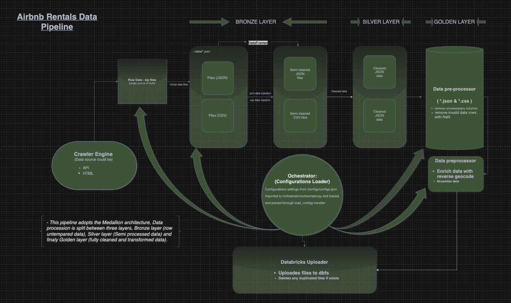

# Data pipeline 1 - (`airbnb`|`rentals`) 

## Overview
1. This is a project that achieves the following:  
   - Ingest rental and airbnb data from  `./data/rentals.json` and `./data/airbnb.csv` respectively
   - Cleans both datasets
   - Enriches datasets by utelizing reverse geocode API
   - Programmatically uploads both datasets to databricks `dbfs`
   - Explore and Upload data into blob storage
   - Explores cleaned data sets through analysis using `matplot` lib and `pandas`
   - Automates different  calculations from data insights from both datasets (`rental` and `Airbnb`) 
   - Simulates visualization of both datasets and saves screenshots to `/scratch` folder for further analysis
   - The Medallion principle is adhered to throughout the handling of data [Medallion Architecture](https://www.databricks.com/glossary/medallion-architecture#:~:text=A%20medallion%20architecture%20is%20a%20data%20design%20pattern,%28from%20Bronze%20%E2%87%92%20Silver%20%E2%87%92%20Gold%20layer%20tables%29.)

### Installation and usage
To run this project, follow these steps:
1. Clone the repository:
   git clone https://github.com/raybags-dev/prop-business-airbnb_rentals.git
2. Navigate to the project directory:
3. Create a virtual environment:
4. Activate the virtual environment:
5. Install dependencies:


> The data processing pipeline is designed to ingest, clean, preprocess, and store rental and Airbnb data. The pipeline performs data cleaning, transformation, and file writing operations to prepare the data for further analysis or usage. It utilizes Python's Pandas library for data manipulation and JSON for data storage.


### Configuration

Configuration settings are loaded using `load_configs` from `ochestrator.ochestrator` module. Configuration includes columns to drop due to NaN values, unnecessary columns to drop, file paths, and output file types.

### Middleware

- **error_handler:** Handles exceptions and logs errors.
- **worker_emulator:** Emulates loading status.

### Utilities

- **worker_emulator:** Emulates loading status using threading and tqdm.

### Dependencies

- Pandas: Data manipulation
- json: JSON data handling
- pathlib: Path operations
- threading: Concurrency
- tqdm: Progress bar
- zipfile: ZIP file handling
- geopy: Geocoding
- colorama: Colored terminal output

### Initialization

1. Load environment variables using `load_dotenv`.
2. Initialize logging using `initialize_logging`.
3. Load configuration settings using `load_configs`.

#### Data Processing Pipeline Execution

1. **Loading Data:**
   - Use `load_rentals_data` and `load_airbnb_data` to ingest rental and Airbnb data.

2. **Data Cleaning and Preprocessing:**
   - Clean the rental data using `clean_rentals_data`.
   - Clean the Airbnb data using `clean_airbnb_data`.
   - Preprocess data using `preprocess_data`.

3. **Data Transformation and Writing:**
   - Execute `data_processor_pipeline` to process and clean the data.
   - Execute file writing operations using `writes_executor`, `json_file_writer`, and `txt_file_writer`.

4. **Notification Handling:**
   - Handle notifications using `writes_notification_handler`.

#### Upload to Databricks

1. **Data Upload Check:**
   - Check if the data is ready for upload and if `upload_to_dbfs` flag is set to `True`.

2. **Upload Execution:**
   - Retrieve the Databricks workspace from environment variables.
   - Upload files to Databricks using `upload_files_to_databricks` from `src.cloud.databricks` module.

3. **Logging Upload Status:**
   - Log completion message for successful upload to Databricks.

---

### Main Entry Point: main.py

> The main entry point of the data processing application orchestrates the entire pipeline and handles data upload to Databricks if configured.

---

## GitHub Actions Workflow (auto pull && merge)

> This GitHub Actions workflow is designed to automatically run tests, create a merge request (MR) from `Your_staging` to `your_main`, and merge the MR if the tests pass successfully.

### Workflow File : 
* The workflow is defined in a YAML file named auto_merge_workflow.yml.
### Trigger : 
* The workflow is triggered on push events to the `staging` branch.
### Jobs:
`test`:
* Runs tests on an ubuntu-latest runner.

```
jobs:
   test:
      runs-on: ubuntu-latest
```

## Configuration
### Required Changes
> To use this workflow, you need to update the following variables in the workflow file:

### AUTO_MERGE_TOKEN: 
  * Replace ${{ secrets.AUTO_MERGE_TOKEN }} with your GitHub personal access token with the necessary permissions.

### Dependencies:
  * `actions/checkout@v3`: For checking out the code.
  * `actions/setup-python@v2`: For setting up Python.
  * `jq`: For JSON parsing in the workflow steps.

### Execution
  Commit this workflow file (auto_merge_workflow.yml) to your repository under the .github/workflows directory.
  Make sure to update the required configuration variables.
  Push to the staging branch to trigger the workflow.